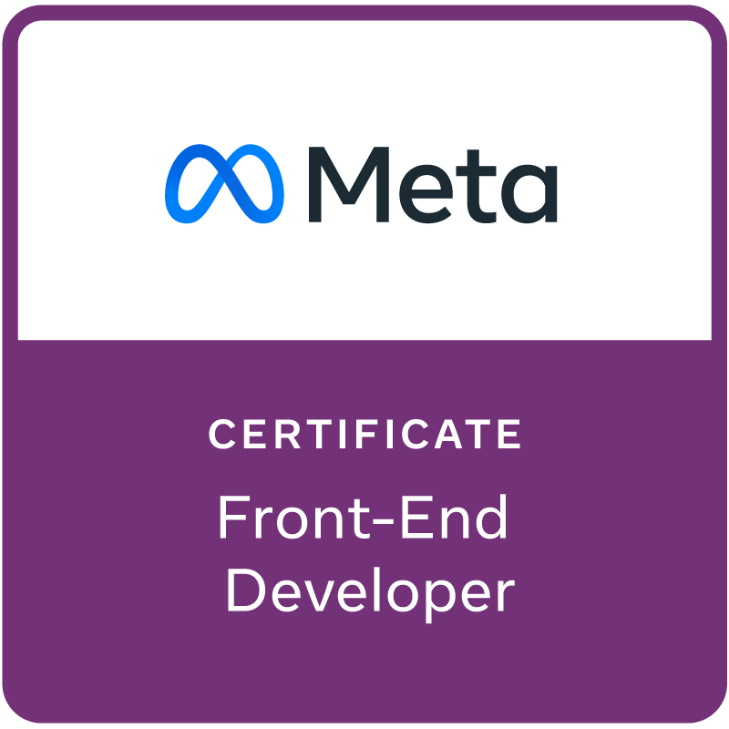

 Hi there 👋
  
 
- 📫 How to reach me: hasini.miryala1010@gmail.com
- 😄 Pronouns: she/her
  
Credly Profile
https://www.credly.com/users/hasini-miryala
LinkedIn Profile
https://www.linkedin.com/in/hasinimiryala/
Portfolio 
https://hasinimiryala1010.netlify.app/

 
